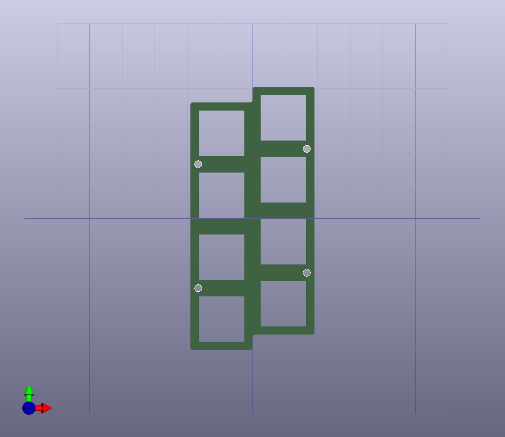
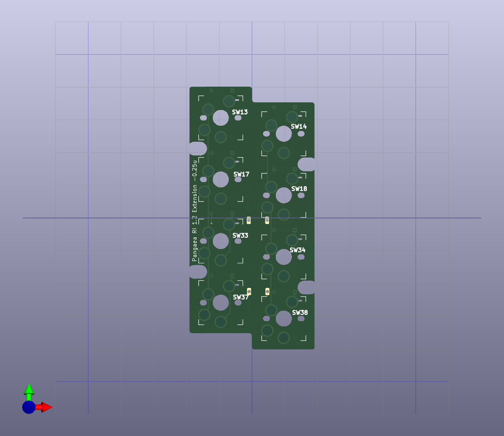
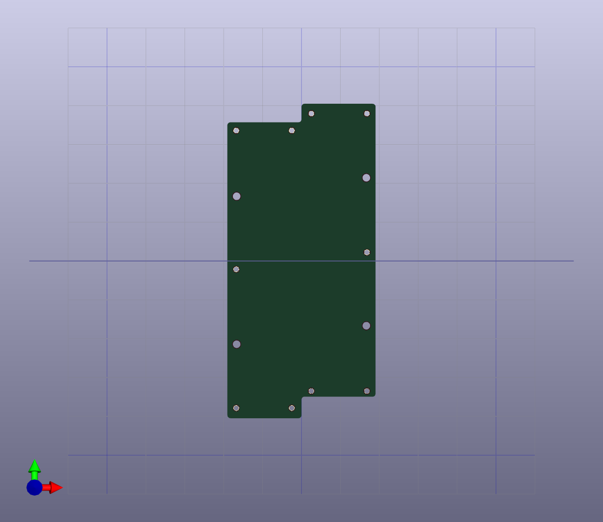

# Pinkey Extension module for Pangaea 1.2
MIT License

Pineky replacement modulet for Pangaea RI 1.2. The left hand end row is 0.25u lower than the left hand end row.
This is the physical layout used on many keyboards.  The 0.5u lower version is also availavle.

Compatible with Cherry MX and Choc switches as well as standard parts.

# note

You can use the same top plate as the Same-special, which is not included here. It is included in Pangaea's standard package, so please use that.

# history

* 3/21 PCB ordered.
